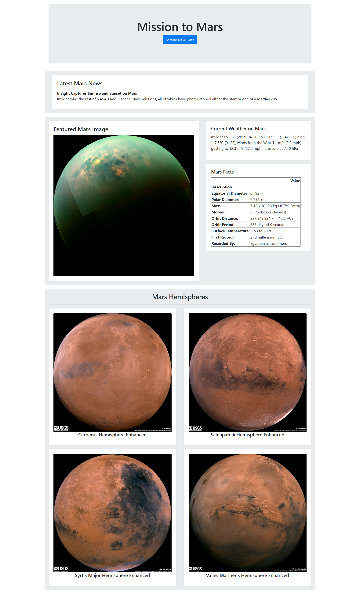

# Mission to Mars

**Description**  
Web application that scrapes various websites for data related to the Mission to Mars and displays the information in a single HTML page.  

**Contents**
* screenshots/  
  * screenshot_MongoDB.png
  * screenshot_desktop.png  
  * screenshot_mobile.png  
* templates/  
  * index.html  
* app.py  
* mission_to_mars.ipynb  
* scrape_mars.py